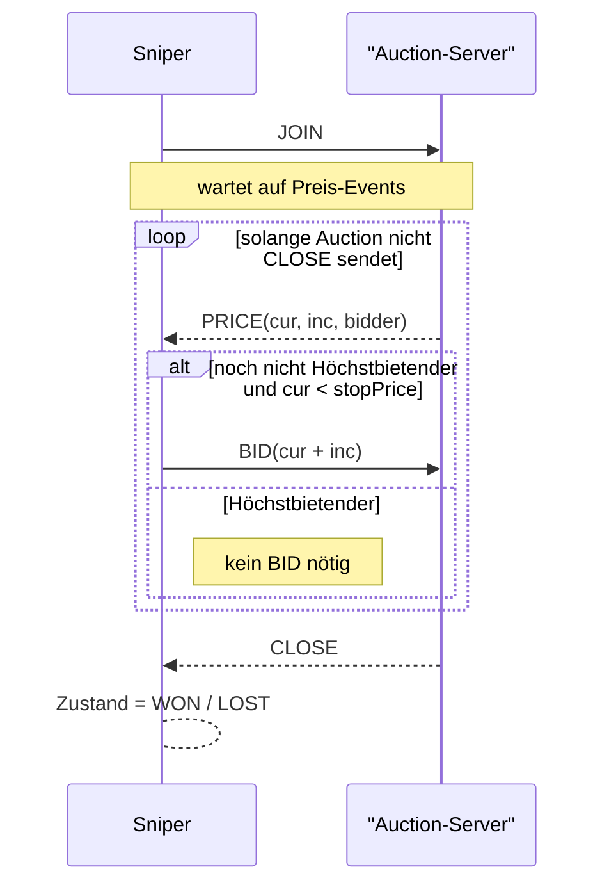

```mermaid
sequenceDiagram
    %% Teilnehmer
    participant Sniper
    participant Auction as "Auction‑Server"
    
    %% Einstieg
    Sniper ->> Auction: JOIN
    Note over Sniper,Auction: wartet auf Preis‑Events
    
    %% Wiederholte Preisrunden
    loop solange Auction nicht CLOSE sendet
        Auction -->> Sniper: PRICE(cur, inc, bidder)
        alt noch nicht Höchstbietender<br/>und cur < stopPrice
            Sniper ->> Auction: BID(cur + inc)
        else Höchstbietender
            Note right of Sniper: kein BID nötig
        end
    end
    
    %% Ende der Auktion
    Auction -->> Sniper: CLOSE
    Sniper --> Sniper: Zustand = WON / LOST
```