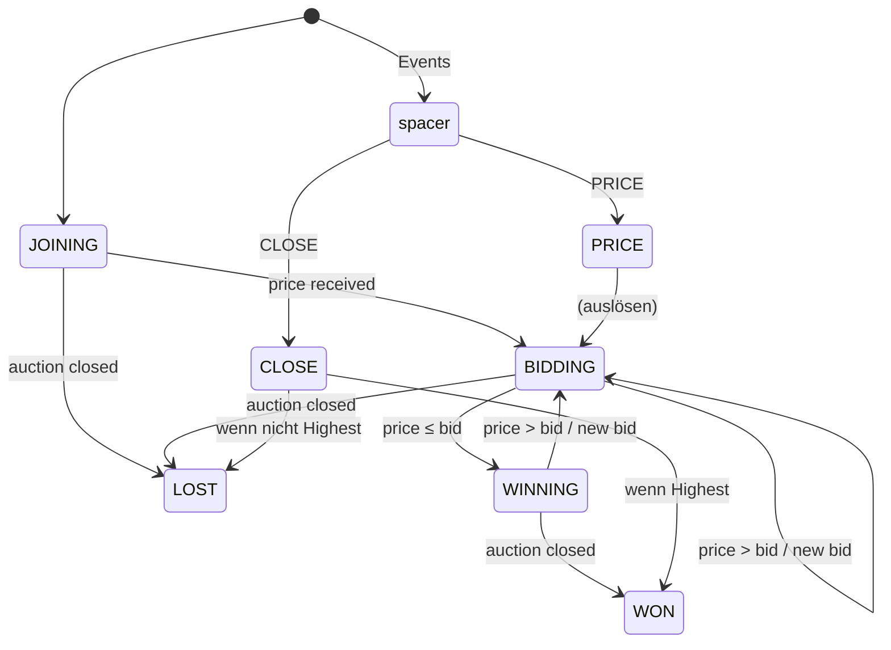

```mermaid
stateDiagram-v2
    [*] --> JOINING
    
    %% Zustände
    state JOINING
    state BIDDING
    state WINNING
    state WON
    state LOST
    
    %% Übergänge
    JOINING --> BIDDING : price received
    JOINING --> LOST    : auction closed
    
    BIDDING --> WINNING : price ≤ bid
    BIDDING --> BIDDING : price > bid / new bid
    BIDDING --> LOST    : auction closed
    
    WINNING --> BIDDING : price > bid / new bid
    WINNING --> WON     : auction closed
    
    %% -----------------------------
    %% Ereignis‑Schiene (unten)
    state " " as spacer
    spacer --> PRICE     : PRICE
    spacer --> CLOSE     : CLOSE
    [*] --> spacer       : Events
    
    %% Visuelle Verbindung (optional)
    PRICE --> BIDDING : (auslösen)
    CLOSE --> LOST    : wenn nicht Highest
    CLOSE --> WON     : wenn Highest
```